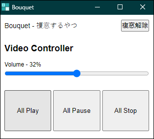

# Bouquet - 複窓するやつ

 

[English version is here.](./README.md)

1つのウィンドウの中にあるタブを、画面上に整列させます。  
複数の情報を並べて確認したいときに便利です。

## Download

Google Chromeにインストールしてください。

## 使い方

1. このブラウザ拡張のアイコンをクリックします
2. 必要に応じて設定を変更します
3. 「**複窓で開く**」ボタンを押す

※ うまく動作しないときは、一度リロードしてみてください

### YouTubeについて

YouTubeのページをポップアップモードで複窓した場合、少しだけJavaScriptによる見た目の調整が行われます。

## 複窓コントローラ

「複窓で開く」ボタンを押すと専用のコントローラウィンドウが表示されます。

複窓を1つのウィンドウにまとめたい場合は「**複窓解除**」ボタンをクリックしてください。

このツールで開いたページの中に動画プレイヤーが含まれているとき、すべての動画プレイヤーを同時に操作できます。

### Video Controllerについての注意

動画プレイヤーのステータス（再生・停止・音量）が実際のプレイヤー上の表示とは異なる可能性があります。

このツールによる動画の操作は純粋なWeb APIを利用したものであるためです。

#### 音量

Volumeの初期状態の値は「？」です。

このツールで操作すると一律で音量をそろえることができますが、各動画の音量はバラバラのため、必要に応じて各プレイヤーを手動で調整してください。

#### 再生・停止

- All Play - すべての動画を再生する
- All Pause - すべての動画を一時停止する
- All Stop - すべての動画を停止して、シークバーを0にする
