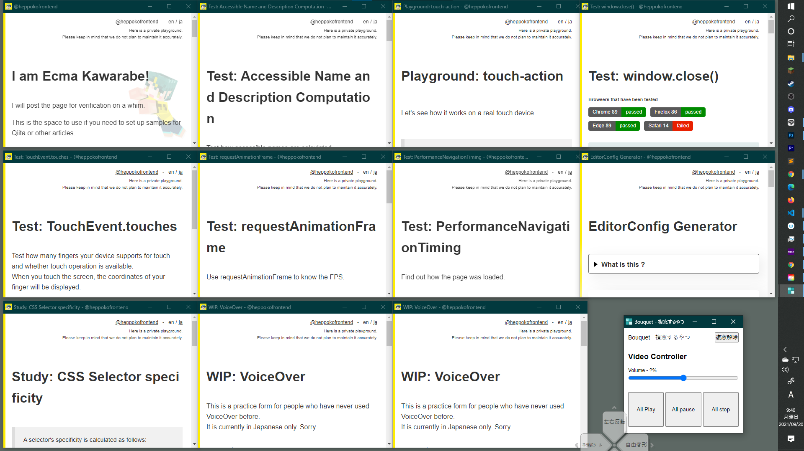
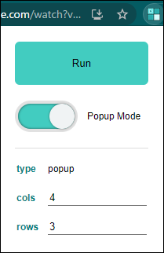
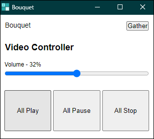

# Bouquet

 

[日本語はこちら](./README--ja.md)

Arrange all tabs of the currently open window in screen.  
This is useful when you want to check multiple pieces of page in a row.

## Download

Install it on your Google Chrome from here.

## 使い方

1. Click the Chrome Extension icon
2. Set it up
3. Click the **Run** button.

\* If it doesn't work, try reloading it again.

### When using it on YouTube

If you display a YouTube page in pop-up mode by this tool, a little JavaScript will be used to adjust its appearance.

## How to use the controller

Click the "Run" button to open the bouquet controller window.

If you want to combine all the windows opened by this tool into one window, click the **Gather** button.

When a video player is included in the window opened by this tool, you can control all video players simultaneously via the bouquet controller.

### Note on Video Controller

The state of the video player (play, stop, volume) may differ from what the actual player looks like.

This is because the video manipulation by this tool is purely Web API based.

#### Sound Volume

The default value of Volume is "?".

You can use this tool to adjust the volume uniformly.

However, in general, the volume of each video varies from video to video. So you should manually adjust the volume of each video player as needed.

#### Play/Pause/Stop

- All Play - Play all videos.
- All Pause - Pause all videos.
- All Stop - Stop all videos (set the seek bar to 0)
